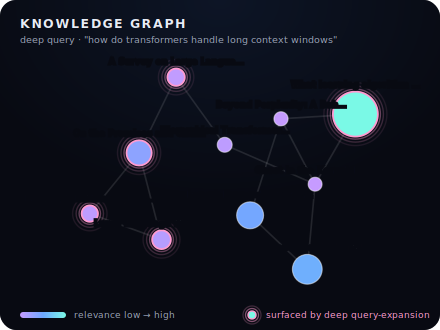

# ScholarRAG — Academic Knowledge Base & Literature-Review Generator

ScholarRAG is a production-grade RAG pipeline over arXiv papers.  It ingests
scientific papers, parses figures and equations with Nougat/GROBID, and serves
a literature-review generator that answers research questions with **traceable
inline citations** and quantitative quality metrics — or an explicit
*abstention* when the corpus can't support an answer.

**▶ Live demo** (free, hosted on Modal): **https://ashutoshmore7596--scholar-rag-web.modal.run**

### The knowledge graph

Every query renders an interactive, dependency-free **force-directed knowledge graph** — the papers it retrieved, linked by semantic similarity, sized by relevance + citations. In **deep** mode, papers surfaced *only* by query-expansion (HyDE / multi-query) pulse with a **pink halo**, so you can literally see what the deeper pipeline added over a plain query:



### Two ways to run — local-first, hosted-optional

Every model-serving component runs **local by default or hosted when you set a
key**, chosen through a single backend abstraction
([`generate/llm.py`](src/scholar_rag/generate/llm.py) speaks both the Ollama and
OpenAI wire formats). Clone and go with zero API keys, or scale the heavy pieces
onto free hosted inference:

| Component | Default (local, no keys) | Opt-in (set a key) |
|---|---|---|
| Generation | Ollama (Llama 3.x) | Groq (`llama-3.1-8b` / `llama-3.3-70b`) |
| Reranking | `bge-reranker-v2-m3` | Jina reranker API |
| Vector store | Qdrant in Docker | Qdrant Cloud |
| Query embedding | BGE-M3 — always local (must match the corpus vectors) | — |

`make up && make serve` gives a fully self-contained system. Setting
`DEEP_LLM_API_KEY` / `JINA_API_KEY` / `QDRANT_URL` moves the RAM-heavy pieces onto
free hosted APIs — which is exactly what powers the live demo, deployed on
**Modal** (CPU, scale-to-zero: `modal deploy modal/scholar_rag_modal.py`).

### Further reading

- **[ARCHITECTURE.md](ARCHITECTURE.md)** — retrieval design + the latency/quality
  debugging investigations (the engineering story, with measurements).

- **[docs/DESIGN_DECISIONS.md](docs/DESIGN_DECISIONS.md)** — why each tool was
  chosen over its alternatives, the constraints that drove the architecture, and
  the trade-offs accepted at every layer.
- **[docs/PIPELINE_WALKTHROUGH.md](docs/PIPELINE_WALKTHROUGH.md)** — a step-by-step
  trace of a paper from raw PDF to a cited sentence, and a question from input to
  answer, naming what each process does and which tool performs it.

---

## Architecture

```
arXiv API / S3 · OpenAlex · Semantic Scholar
         │
         ▼
  ┌─────────────┐    ┌─────────────────┐    ┌──────────────────────┐
  │  Ingestion  │───▶│ Transformation  │───▶│  Embedding (BGE-M3)  │
  │ arxiv_crawl │    │ Nougat/GROBID   │    │ dense + sparse +     │
  │ citation    │    │ propositions    │    │ optional ColBERT     │
  │ enrichment  │    │ parent/child    │    └──────────┬───────────┘
  └─────────────┘    │ contextual hdrs │               │
                     └─────────────────┘               ▼
                                               ┌───────────────┐
                                               │  Qdrant store │
                                               │ + DuckDB graph│
                                               └───────┬───────┘
                                                       │
  Researcher ──query──▶ FastAPI ──────────────────────▶│
                          │      HyDE · multi-query     │
                          │      hybrid+RRF · rerank     │
                          │      graph-boost · CRAG      │
                          ▼      cited generation ◀──────┘
                    Web UI (served at /)
                          │
                    RAGAS eval loop
```

---

## Advanced techniques

| Failure mode of naive RAG | Technique applied |
|---|---|
| Fixed chunks split arguments mid-thought | **Proposition-based + layout-aware chunking** |
| Short query ≠ dense academic phrasing | **HyDE + multi-query expansion** |
| Pure vector search misses exact terms | **Hybrid BM25+dense with RRF** |
| Top-k cosine is noisy | **Cross-encoder reranking (bge-reranker-v2-m3)** |
| All papers treated equally | **Citation-graph-aware reranking** (α·rerank + β·log_influence + γ·recency) |
| LLM hallucinates | **Self-RAG reflection + citation enforcement + abstention** |
| Opaque evaluation | **RAGAS metric suite** (native, Groq-judged) + optional MLflow logging |

---

## End-to-end run guide

This section walks you through every step from a clean machine to a running
literature-review system.  Each phase is independently verifiable before
proceeding to the next.

### System requirements

| Resource | Minimum | Recommended |
|---|---|---|
| RAM | 8 GB | 16 GB |
| Disk | 20 GB free | 40 GB (for PDFs + models) |
| CPU | 4 cores | 8 cores |
| GPU | not required | optional (speeds up embedding) |
| OS | macOS 12+ / Ubuntu 20.04+ / Windows WSL2 | — |

---

### Phase 0 — Prerequisites

Install the three tools that must exist on the host before anything else.

#### 0a. Docker Desktop (or Docker Engine on Linux)

```bash
# macOS — download from https://www.docker.com/products/docker-desktop/
# or via Homebrew:
brew install --cask docker

# Ubuntu:
curl -fsSL https://get.docker.com | sh
sudo usermod -aG docker $USER   # then log out and back in

# Verify:
docker --version          # Docker version 24+
docker compose version    # Docker Compose version 2+
```

#### 0b. Python 3.10 or newer

```bash
# Check what you have:
python3 --version

# macOS (if missing):
brew install python@3.11

# Ubuntu:
sudo apt install python3.11 python3.11-venv python3-pip
```

#### 0c. Ollama (local LLM runtime)

```bash
# macOS / Linux one-liner:
curl -fsSL https://ollama.com/install.sh | sh

# macOS via Homebrew:
brew install ollama

# Windows: download the installer from https://ollama.com/download

# Verify (Ollama starts a background service automatically after install):
ollama --version
```

---

### Phase 1 — Project setup

```bash
# 1. Enter the project directory
cd scholar-rag              # already inside the repo

# 2. Copy environment config
cp .env.example .env
# Open .env and adjust if needed (defaults work for local dev)

# 3. Create a virtual environment and install all dependencies
#    Option A — uv (faster, recommended):
uv venv .venv
source .venv/bin/activate        # Windows: .venv\Scripts\activate
uv pip install -e ".[dev]"

#    Option B — standard pip:
python3 -m venv .venv
source .venv/bin/activate
pip install -e ".[dev]"

# Verify the package is importable:
python -c "import scholar_rag; print('Package OK')"
```

---

### Phase 2 — Start Docker services

This brings up Qdrant, GROBID, MLflow, and a DuckDB REST helper in one command.
Ollama runs natively (not in Docker) for better performance.

```bash
docker compose up -d

# Watch until all containers are healthy (takes ~30 s first time):
docker compose ps
```

Expected output — all services should show `running` or `healthy`:

```
NAME                STATUS
scholar_qdrant      running   (port 6333)
scholar_grobid      running   (port 8070)
scholar_mlflow      running   (port 5000)
scholar_duckdb      running   (port 8888)
```

Verify each service individually:

```bash
curl -s http://localhost:6333/healthz          # Qdrant → {"result":"ok"}
curl -s http://localhost:8070/api/isalive      # GROBID → "true"
curl -s http://localhost:5000/health           # MLflow → {"status":"OK"}
```

---

### Phase 3 — Pull LLM models into Ollama

> **Do NOT run `ollama serve`.** If you installed Ollama via `brew install ollama`
> and started it with `brew services start ollama` (or via the macOS app), it is
> already running in the background and starts automatically at login. Running
> `ollama serve` again just prints a harmless
> `bind: address already in use` — Ollama is fine, ignore it.
> Check it's up with `curl -s http://localhost:11434/api/tags` (returns JSON).

```bash
# Pull the generation model (~4.7 GB):
ollama pull llama3.1:8b

# Pull the embedding fallback model (~274 MB):
ollama pull nomic-embed-text

# Verify both are available:
ollama list
# Expected output:
# NAME                    ID            SIZE    MODIFIED
# llama3.1:8b             ...           4.7 GB  ...
# nomic-embed-text        ...           274 MB  ...
```

> **Tip:** `qwen2.5:7b` or `mistral:7b` are drop-in alternatives — edit
> `OLLAMA_MODEL` in `.env` to switch.

---

### Phase 4 — Download embedding and reranker models

BGE-M3 and bge-reranker-v2-m3 are downloaded automatically from HuggingFace
the first time they are used.  Pre-download them now to avoid a wait during
ingestion:

```bash
python - <<'EOF'
from FlagEmbedding import BGEM3FlagModel, FlagReranker
import os

print("Downloading BGE-M3...")
BGEM3FlagModel("BAAI/bge-m3", use_fp16=False)

print("Downloading bge-reranker-v2-m3...")
FlagReranker("BAAI/bge-reranker-v2-m3", use_fp16=False)

print("Models ready.")
EOF
```

> First download: BGE-M3 is ~2.3 GB, reranker is ~1.1 GB.  They are cached
> in `~/.cache/huggingface/` and never re-downloaded.

---

### Phase 5 — Create the Qdrant collection

```bash
python - <<'EOF'
from scholar_rag.store.qdrant_store import QdrantStore
QdrantStore().create_collection()
print("Collection created.")
EOF

# Verify in the Qdrant dashboard (optional): http://localhost:6333/dashboard
```

---

### Phase 6 — Ingest arXiv papers

This is the main offline pipeline: crawl → enrich citations → parse PDFs →
proposition-chunk → embed → store in Qdrant + DuckDB.

```bash
# Small smoke-test run first (~20 papers, takes 5-10 min):
python - <<'EOF'
from scholar_rag.config import load_config
from scholar_rag.ingest.pipeline import run_ingestion

cfg = load_config()
cfg["ingestion"]["categories"] = ["cs.CL"]
cfg["ingestion"]["max_results_per_query"] = 20
cfg["ingestion"]["download_pdfs"] = True
records = run_ingestion(cfg)
print(f"Ingested {len(records)} papers.")
EOF
```

After confirming the smoke test passes, run the full ingestion via the API
(executes in the background — safe to close terminal):

```bash
# Start the API first:
uvicorn src.scholar_rag.api.main:app --host 0.0.0.0 --port 8000 &

# Trigger ingestion (200 papers across cs.CL, cs.IR, cs.LG):
curl -s -X POST http://localhost:8000/ingest \
  -H "Content-Type: application/json" \
  -d '{"categories": ["cs.CL", "cs.IR", "cs.LG"], "max_results": 200}' \
  | python -m json.tool

# Monitor progress via logs:
# The API process will print "Ingestion complete: N records" when done.
```

> **How long?**  ~200 papers with PDF download + proposition extraction takes
> roughly 20–40 min on a modern CPU, depending on Ollama generation speed.
> Citation enrichment is network-bound (~3 s per paper respecting rate limits).

---

### Phase 7 — Run tests

Verify core logic is correct before querying:

```bash
pytest tests/ -v
```

Expected: all 13 tests pass.

```
tests/test_chunkers.py::test_chunk_count          PASSED
tests/test_chunkers.py::test_chunk_has_paper_id   PASSED
tests/test_chunkers.py::test_parent_child_linkage PASSED
tests/test_chunkers.py::test_contextual_header_prepended PASSED
tests/test_chunkers.py::test_approx_tokens        PASSED
tests/test_hybrid.py::test_rrf_basic              PASSED
tests/test_hybrid.py::test_rrf_ordering           PASSED
tests/test_hybrid.py::test_rrf_single_list        PASSED
tests/test_hybrid.py::test_rrf_empty              PASSED
tests/test_hybrid.py::test_rrf_k_constant         PASSED
tests/test_citation_enforcement.py::...           PASSED (x3)
```

---

### Phase 8 — Start the API and open the UI

The FastAPI server hosts both the API **and** the web UI at `/` — no separate
frontend process needed:

```bash
make serve
# or directly:
uvicorn scholar_rag.api.main:app --host 0.0.0.0 --port 8000
```

Open your browser:

| Service | URL |
|---|---|
| **Web UI** (ask · corpus · method · results · knowledge graph) | http://localhost:8000/ |
| **FastAPI docs (Swagger)** | http://localhost:8000/docs |
| **Qdrant dashboard** | http://localhost:6333/dashboard |
| **MLflow experiment tracker** (if running) | http://localhost:5001 |

---

### Phase 9 — Ask a research question

**Via the web UI:**

1. Open http://localhost:8000/
2. Type a question in the search box, e.g.:
   - *"What are the trade-offs between late-interaction and bi-encoder retrieval for long documents?"*
   - *"How does instruction tuning affect LLM generalisation?"*
3. Optionally set the year range or minimum citations in the filters.
4. Click **Ask** — the cited review streams in, with a source knowledge graph below.
5. The cited literature review appears with expandable source cards and arXiv links.

**Via the API directly:**

```bash
curl -s -X POST http://localhost:8000/ask \
  -H "Content-Type: application/json" \
  -d '{
    "query": "What are the trade-offs between late-interaction and bi-encoder retrieval for long documents?",
    "year_from": 2020,
    "top_k": 8
  }' | python -m json.tool
```

Example response shape:

```json
{
  "query": "What are the trade-offs ...",
  "review": "Late-interaction models such as ColBERT [2004.12832] achieve ...",
  "citations": [
    {"paper_id": "2004.12832", "title": "ColBERT", "year": 2020, "score": 0.812}
  ],
  "context_quality": 0.87,
  "abstained": false,
  "latency_ms": 4200
}
```

---

### Phase 10 — Evaluate with the RAGAS metric suite

A golden Q&A set ships at `data/eval/golden_set.json`. Evaluation computes the four
RAGAS metrics — **faithfulness, answer relevancy, context precision, context
recall** — implemented **natively against the Groq judge** (no `ragas` / `langchain`
dependency; see [ARCHITECTURE.md §6](ARCHITECTURE.md) for why). Stop the API server
first (the evaluator needs exclusive access to the DuckDB citation graph), then:

```bash
make eval
# or, directly:
python -m scholar_rag.eval.run_eval            # fast mode
python -m scholar_rag.eval.run_eval --deep     # deep retrieval per question
```

Results are written to `data/eval/ragas_results.{json,csv}` (and logged to MLflow
if `MLFLOW_TRACKING_URI` is reachable). Example on the shipped golden set:

| Mode | answer relevancy | context precision | context recall | faithfulness |
|---|---|---|---|---|
| fast (8B gen) | 0.81 | 0.71 | 0.63 | 0.34 |
| deep (70B gen) | 0.80 | 0.76 | 0.57 | **0.47** |

Retrieval is solid, but faithfulness starts low — the model over-asserts beyond
its context. The fix that works is **post-generation claim grounding** (LLM
entailment-verify each sentence, drop unsupported ones): judged by an *independent*
model, it lifts **faithfulness +56 % (0.53 → 0.82)** while leaving retrieval
metrics untouched. Full analysis — including why cross-encoder reranking of claims
*doesn't* work — in [ARCHITECTURE.md §6](ARCHITECTURE.md).

If `MLFLOW_TRACKING_URI` is set, metrics are also logged to MLflow.

---

### Phase 11 — Run ablation experiments

Compare all technique combinations and log every run to MLflow:

```bash
python - <<'EOF'
from scholar_rag.eval.ablation import run_ablation, ABLATION_CONFIGS
from scholar_rag.config import load_config
from scholar_rag.api.main import _build_pipeline
import json

cfg = load_config()

# Minimal eval queries (replace with your golden set for real ablations)
queries = [
  {"query": "proposition chunking retrieval", "relevant_paper_ids": []},
  {"query": "HyDE hypothetical document embeddings", "relevant_paper_ids": []},
]

def retrieve_fn_factory(ablation_cfg):
    engine, _ = _build_pipeline(ablation_cfg)
    def retrieve(q):
        return engine.retrieve(q).passages
    return retrieve

results = run_ablation(queries, None, retrieve_fn_factory, cfg)
for r in results:
    print(r)
EOF
```

All runs appear in MLflow at http://localhost:5000 — compare nDCG, Recall,
faithfulness across configurations in the UI.

---

### Stopping everything

```bash
# Stop Docker services:
docker compose down

# Stop Ollama (if you started it manually):
pkill ollama

# Stop the API server:
# Ctrl-C in the terminal, or:
pkill -f uvicorn
```

---

### Troubleshooting

| Problem | Fix |
|---|---|
| `Connection refused :6333` | Run `docker compose up -d` and wait 15 s |
| `Connection refused :11434` | Run `ollama serve` in a separate terminal |
| `ModuleNotFoundError: scholar_rag` | Activate venv (`source .venv/bin/activate`) and re-run `pip install -e .` |
| BGE-M3 download hangs | Check internet access; model is ~2.3 GB from HuggingFace |
| `GROBID not available` — parse falls back to PyMuPDF | Normal; GROBID is an optional enhancement |
| Ollama response timeout | Model is still loading; wait 30 s and retry |
| Qdrant `collection not found` | Run Phase 5 (create-collection) first |
| `make eval` errors on a DuckDB lock | Stop the API server (`make serve`) first — the evaluator needs exclusive access to the citation graph |

---

## Repository structure

```
scholar-rag/
├── docker-compose.yml
├── .env.example
├── Makefile
├── pyproject.toml
├── configs/
│   ├── default.yaml              # all hyper-parameters
│   └── experiments/              # ablation overrides
├── data/
│   ├── raw/                      # PDFs + arXiv JSON sidecars
│   ├── parsed/                   # Nougat/GROBID markdown
│   └── eval/                     # golden Q&A set
├── src/scholar_rag/
│   ├── config.py                 # YAML + env-var config loader
│   ├── ingest/
│   │   ├── arxiv_crawler.py      # arXiv API, resumable PDF download
│   │   ├── citation_enrich.py    # OpenAlex + Semantic Scholar
│   │   └── pipeline.py           # ingestion orchestrator
│   ├── transform/
│   │   ├── parse_nougat.py       # math-aware PDF→Markdown
│   │   ├── parse_grobid.py       # TEI XML→Markdown fallback
│   │   ├── propositions.py       # LLM proposition extraction
│   │   ├── contextual_headers.py # per-chunk context sentence
│   │   └── chunkers.py           # parent/child hierarchical chunker
│   ├── embed/
│   │   ├── bge_m3.py             # dense + sparse + ColBERT
│   │   └── embedder.py           # batch embedding orchestrator
│   ├── store/
│   │   ├── qdrant_store.py       # named vectors + payload schema
│   │   └── graph_store.py        # DuckDB citation graph
│   ├── retrieve/
│   │   ├── hyde.py               # hypothetical document embeddings
│   │   ├── multi_query.py        # query expansion + decomposition
│   │   ├── hybrid_rrf.py         # dense+sparse RRF fusion
│   │   ├── rerank.py             # cross-encoder reranker
│   │   ├── graph_rerank.py       # citation/recency boosting
│   │   ├── crag.py               # corrective retrieval evaluator
│   │   └── engine.py             # full retrieval pipeline
│   ├── generate/
│   │   ├── prompts.py            # system/user prompt templates
│   │   ├── cited_generator.py    # Self-RAG + citation enforcement
│   │   └── agent.py              # optional ReAct multi-hop agent
│   ├── eval/
│   │   ├── ragas_eval.py         # RAGAS metrics (native, Groq-judged) + run_eval CLI
│   │   ├── retrieval_metrics.py  # nDCG / Recall / MRR
│   │   └── ablation.py           # systematic ablation harness
│   ├── api/
│   │   └── main.py               # FastAPI: /ask, /ingest, /health
│   └── ui/
│       └── app.py                # Streamlit UI
└── tests/
    ├── test_chunkers.py
    ├── test_hybrid.py
    └── test_citation_enforcement.py
```

---

## API reference

### `POST /ask`

```json
{
  "query": "What are the trade-offs between late-interaction and bi-encoder retrieval?",
  "year_from": 2021,
  "top_k": 8
}
```

Response:

```json
{
  "review": "Late-interaction models such as ColBERT [2004.12832] ...",
  "citations": [{"paper_id": "2004.12832", "title": "ColBERT", "year": 2020, ...}],
  "context_quality": 0.87,
  "abstained": false,
  "latency_ms": 4200
}
```

### `POST /ingest`

```json
{"categories": ["cs.CL", "cs.IR"], "max_results": 200, "date_from": "2023-01-01"}
```

Returns immediately; ingestion runs in the background.

### `GET /health`

```json
{"status": "ok", "model": "llama3.1:8b"}
```

### `GET /papers?limit=100&offset=0`

Lists indexed paper ids and metadata from Qdrant.

---

## Evaluation targets

| Metric | Target |
|---|---|
| RAGAS Faithfulness | ≥ 0.90 |
| RAGAS Answer Relevancy | ≥ 0.85 |
| Context Precision (rerank vs no-rerank) | ≥ +15% |
| Recall@20 (hybrid vs dense-only, SciFact) | measurable gain |
| Citation coverage | 100% of claims carry a valid citation |

---

## Ablation experiments

| Experiment | Description |
|---|---|
| `full_pipeline` | All techniques enabled |
| `no_hyde` | Disable HyDE |
| `no_multi_query` | Single query only |
| `dense_only` | No BM25 sparse retrieval |
| `no_rerank` | Pass-through top-50 without reranking |
| `no_graph_rerank` | Cross-encoder only (no citation boost) |

---

## Data sources

- **arXiv API**: https://info.arxiv.org/help/api/index.html
- **OpenAlex** (open scholarly graph): https://docs.openalex.org/
- **Semantic Scholar API**: https://api.semanticscholar.org/
- **BGE-M3**: https://huggingface.co/BAAI/bge-m3
- **bge-reranker-v2-m3**: https://huggingface.co/BAAI/bge-reranker-v2-m3
- **Eval — SciFact**: https://github.com/allenai/scifact
- **Eval — QASPER**: https://allenai.org/data/qasper
